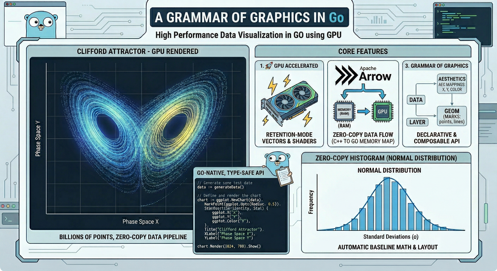
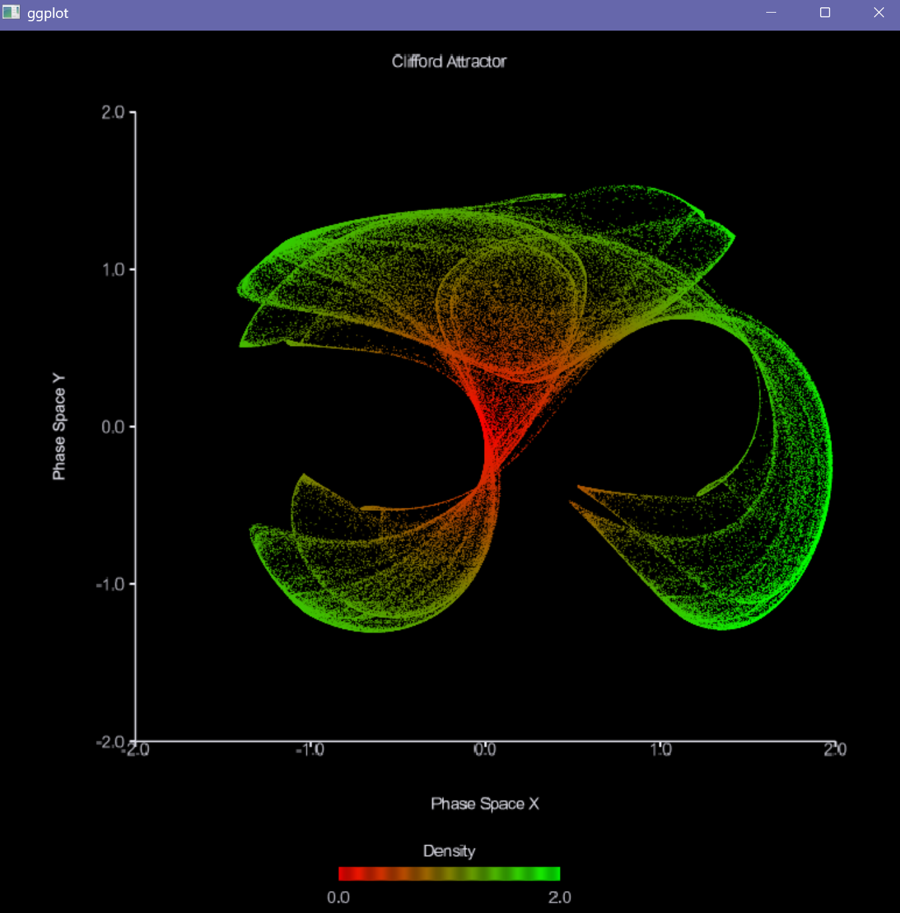
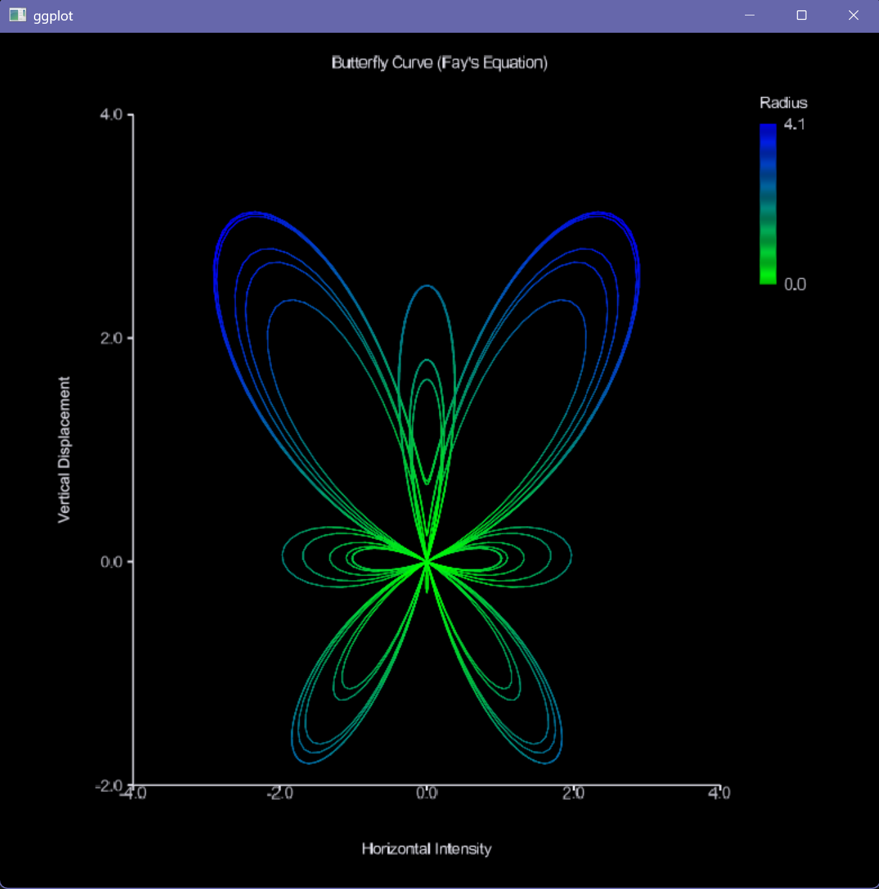
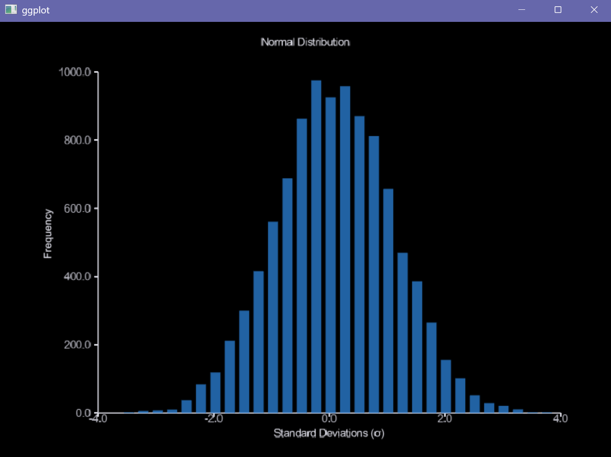

# ggplot (Go Grammar of Graphics)

`ggplot` is a production-grade, pure-Go Grammar of Graphics high-performance, GPU-accelerated plotting library for Go, inspired by the declarative Grammar of Graphics (ggplot2, Altair).

Built on the **gogpu stack**, it leverages **Apache Arrow** for zero-copy data pipelines and **gogpu/gg** for retained-mode vector rendering. It is designed to handle massive datasets—like chaotic attractors, machine learning loss curves, and dense histograms—without breaking a sweat or triggering the Go garbage collector.

### Powered by:
* **[apache/arrow](https://github.com/apache/arrow)**: Apache Arrow is a cross-language development platform for in-memory data
* **[gogpu/gg](https://github.com/gogpu/gg)**: High-performance vector graphics and GPU-accelerated rendering.
* **[gogpu/ui](https://github.com/gogpu/ui)**: Retained-mode UI framework for building interactive data applications.

## Gallery
*High-density rendering using `MarkPoint` with 5% opacity alpha-blending and data-driven color scales:*

*Self-intersecting vector path rendering using `MarkLine` with continuous color interpolation:*

*Calculated baseline geometry and dynamic Box Model layouts using `MarkBar`:*

## Architecture Highlights
- **Pure Software Execution**: Built fundamentally maintaining strict `CGO_ENABLED=0` pipelines decoupling!
- **Zero-Copy First**: Utilizes Apache Arrow layouts managing slices through `NativeFilterProvider` logics routines `[]float64` array duplications avoiding heap allocations. 
- **FlightSQL Native Introspection**: Allows utilizing `github.com/apache/arrow-adbc` generating strings building SQL expressions pulling database configurations into physical eagerly!
- **Rigorous Grammar Rules**: Employs structural `Dataset -> AST -> Scales -> Layout -> Render` compiling throwing specific missing requirement.

## Official Documentation

Consult our extensive architectural markdown references located entirely within `/docs/`:
- [`ARCHITECTURE.md`](docs/ARCHITECTURE.md): The separation of components (`pkg/plot`, `geom`, `internal/layout`).
- [`ZERO_COPY.md`](docs/ZERO_COPY.md): How Arrow layouts ensure optimal boundaries.
- [`BACKENDS.md`](docs/BACKENDS.md): Guide covering execution logic utilizing optional accelerated GPU interfaces or physical CPU canvas drawing limits.
- [`EXTENSIONS.md`](docs/EXTENSIONS.md): Writing customized implementations utilizing internal standard layouts!
- [`PERFORMANCE_BUDGET.md`](docs/PERFORMANCE_BUDGET.md): Constraints on allocations and execution timelines.

## Examples & Tutorials 

Explore explicit public API execution maps directly contained inside `/examples/`. 

Available Examples:
* `scatter/`: Native data limits!
* `histogram/`: Statistical overrides generating boundaries!
* `linechart/`: Generating trend lines generating limits!
* `facet/`: Resolving grid dimensions isolating boundaries.
* `theme/`: Configuration over aesthetic constants directly!
* `flightsql/`: Native pushdowns translating layout!
* `render_cpu/`: Explicit native drawing independently locally!
* `render_gpu/`: Hardware interactive visual bindings directly!

## Development & Profiling
